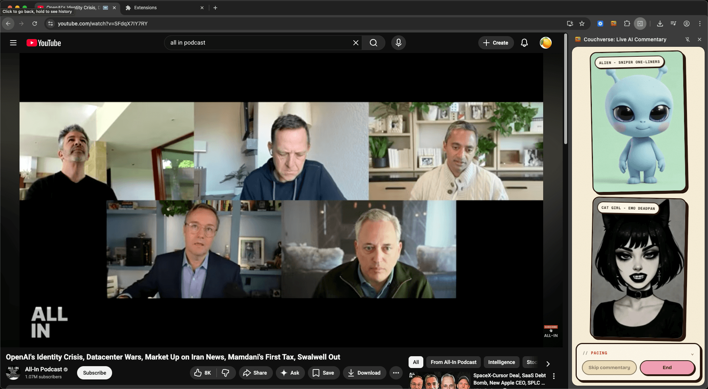

# Watch with Fox: Never watch YouTube alone again

[](LICENSE)

A full-stack app where users watch YouTube alongside **Fox**, an AI comedian avatar that delivers real-time comedic commentary. Think MST3K meets AI: Fox listens to the podcast audio, understands what's being discussed, and drops witty one-liners and observations via an animated talking fox avatar.

<!-- Screenshot: place a 1200×630 image at docs/screenshot.png (see note below) -->
<p align="center">
  
</p>

## Table of Contents

- [How It Works](#how-it-works)
- [Tech Stack](#tech-stack)
- [Architecture](#architecture)
- [Getting Started](#getting-started)
  - [Prerequisites](#prerequisites)
  - [API Keys](#api-keys)
  - [Installation](#installation)
  - [Environment Setup](#environment-setup)
  - [Running the App](#running-the-app)
- [Deployment](#deployment)
- [Project Structure](#project-structure)
- [Key Architecture Decisions](#key-architecture-decisions)
- [Troubleshooting](#troubleshooting)
- [Contributing](#contributing)
- [License](#license)

## How It Works

1. **Paste a YouTube URL** into the web app
2. **Fox joins the watch session** — he listens to the podcast audio in real time
3. **He reacts with comedic commentary** — posh, snarky observational humor, one-liners, and callbacks delivered through an animated avatar

## Tech Stack

| Layer | Technology |
|-------|-----------|
| Frontend | Next.js 16, React 19, TypeScript, Tailwind CSS v4 |
| API Server | FastAPI, asyncpg, Neon PostgreSQL, Fly.io |
| AI Agent | LiveKit Agents, Groq (Whisper STT + Llama Scout LLM), ElevenLabs TTS, LemonSlice avatar |
| Realtime | LiveKit Cloud (WebRTC) |

## Architecture

```
┌──────────────────┐       ┌──────────────────┐       ┌──────────────────────┐
│   Next.js 16     │──────▶│  FastAPI Server   │──────▶│   LiveKit Agent      │
│   Frontend       │       │  (Fly.io)         │       │   (LiveKit Cloud)    │
│                  │       │                   │       │                      │
│  - YouTube player│       │  - Session mgmt   │       │  - Groq Whisper STT  │
│  - Web Audio API │       │  - Token gen      │       │  - Llama Scout LLM   │
│    audio capture │       │  - Audio proxy    │       │  - ElevenLabs TTS    │
│  - Avatar sidebar│       │  - Neon Postgres  │       │  - LemonSlice avatar │
│  - Audio ducking │       │                   │       │  - Commentary timer  │
└──────────────────┘       └──────────────────┘       └──────────────────────┘
```

### Frontend (`web/`)

Split-panel UI with YouTube player on the left and Fox's animated avatar on the right.

- **VideoPlayer** — YouTube iframe + hidden `<audio>` element. Audio is captured via Web Audio API and published to LiveKit for the agent to hear. The hidden audio element avoids CORS issues by streaming through the server's audio proxy.
- **AvatarSidebar** — Renders Fox's LemonSlice avatar video track from LiveKit with live commentary captions.
- **CommentaryControls** — Volume sliders (video & Fox), play/pause, hold-to-talk mic input, end session.
- **Audio ducking** — When Fox speaks, video volume is automatically reduced via WebRTC data channel signals (`commentary_start` / `commentary_end`).

### API Server (`server/src/podcast_commentary/api/`)

Manages sessions, generates LiveKit tokens, proxies YouTube audio streams (to avoid CORS), and serves the avatar image. Backed by Neon PostgreSQL via asyncpg.

**Endpoints:**
- `POST /api/sessions` — Create session, extract audio URL via yt-dlp, generate LiveKit token
- `GET /api/sessions/{id}` — Retrieve session metadata
- `POST /api/sessions/{id}/end` — End a session
- `GET /api/audio-stream/{id}` — Proxy YouTube audio (supports Range headers for seeking)
- `GET /health` — Health check

### AI Agent (`server/src/podcast_commentary/agent/`)

The `ComedianAgent` class manages the full pipeline:

1. **STT**: Groq Whisper (`whisper-large-v3-turbo`) transcribes podcast audio in real time
2. **Commentary timing**: Pressure-based system decides when to comment (min gap 5s, max silence 12s, burst limit 8/60s)
3. **LLM**: Groq Llama Scout (`meta-llama/llama-4-scout-17b-16e-instruct`) generates comedic commentary from transcript context + rolling summary
4. **TTS**: ElevenLabs (`eleven_turbo_v2_5`, voice: Callum) speaks the commentary
5. **Avatar**: LemonSlice animates a fox avatar with lip-sync to TTS audio

Background loops: `_commentary_loop` (2s interval, evaluates triggers), `_summarize_loop` (15s interval, updates rolling transcript summary every 8 utterances).

## Getting Started

### Prerequisites

- Python 3.11+ with [uv](https://docs.astral.sh/uv/)
- Node.js 18+
- [LiveKit CLI](https://docs.livekit.io/home/cli/cli-setup/) (`lk`) — for agent deployment
- [Fly.io CLI](https://fly.io/docs/flyctl/) (`fly`) — for API deployment

### API Keys

You'll need accounts and API keys from these services:

| Service | What it does | Sign up |
|---------|-------------|---------|
| [LiveKit Cloud](https://cloud.livekit.io/) | WebRTC rooms for real-time audio/video | Dashboard → Settings → Keys |
| [Groq](https://console.groq.com/) | Speech-to-text (Whisper) and LLM (Llama Scout) | Console → API Keys |
| [ElevenLabs](https://elevenlabs.io/) | Text-to-speech for Fox's voice | Profile → API Key |
| [LemonSlice](https://www.lemonslice.com/) | Animated avatar rendering | Dashboard → API Keys |
| [Neon](https://neon.tech/) *(optional)* | Serverless PostgreSQL | Dashboard → Connection Details |

> The database is optional. If `DATABASE_URL` is unset, the app runs without persistence — conversation logging silently no-ops.

### Installation

```bash
# Clone the repo
git clone https://github.com/lemonsliceai/watch-with-fox.git
cd watch-with-fox

# Install Python dependencies
cd server && uv sync

# Download required model files
uv run python src/podcast_commentary/agent/main.py download-files

# Install frontend dependencies
cd ../web && npm install
```

### Environment Setup

Copy the example and fill in your keys:

```bash
cp server/.env.example server/.env
```

Edit `server/.env`:

```env
LIVEKIT_URL=wss://your-project.livekit.cloud
LIVEKIT_API_KEY=...
LIVEKIT_API_SECRET=...
GROQ_API_KEY=...
ELEVEN_API_KEY=...
LEMONSLICE_API_KEY=...
DATABASE_URL=postgresql://...          # optional — omit to run without persistence
AVATAR_URL=http://PUBLIC_URL/static/fox_2x3.jpg
AGENT_NAME=podcast-commentary-agent-local
```

The web app reads `NEXT_PUBLIC_API_URL` from `web/.env` (defaults to `http://localhost:8080`). To point at your own hosted API server, update this value:

```bash
cp web/.env.example web/.env
# Edit web/.env → set NEXT_PUBLIC_API_URL to your server
```

### Running the App

You need **three terminals**. They connect like this:

```
web (localhost:3000) ──HTTP──▶ api (localhost:8080) ──token/dispatch──▶ LiveKit Cloud ◀──rtc── agent (local)
```

**Terminal 1 — API Server** (port 8080, auto-reload):
```bash
cd server
uv run uvicorn podcast_commentary.api.app:app --host 0.0.0.0 --port 8080 --reload
```

**Terminal 2 — Agent** (connects to LiveKit Cloud, waits for dispatched jobs):
```bash
cd server
uv run python src/podcast_commentary/agent/main.py dev
```

**Terminal 3 — Web App** (port 3000):
```bash
cd web
npm run dev    # reads API URL from web/.env (default: http://localhost:8080)
```

Then open <http://localhost:3000> and paste a YouTube URL.

> **Tip:** To point the frontend at a remote API server, update `NEXT_PUBLIC_API_URL` in `web/.env`.

## Project Structure

```
├── server/
│   ├── src/podcast_commentary/
│   │   ├── agent/              # LiveKit AI agent (STT → LLM → TTS → Avatar)
│   │   │   ├── main.py         # ComedianAgent class & agent entrypoint
│   │   │   ├── commentary.py   # Timing engine, transcript buffer, trigger logic
│   │   │   └── prompts.py      # System prompts for Fox's personality
│   │   ├── api/                # FastAPI HTTP server
│   │   │   ├── app.py          # App factory with CORS, static files & migrations
│   │   │   └── routes/
│   │   │       └── sessions.py # Session CRUD, token gen, audio proxy
│   │   └── core/               # Shared utilities
│   │       ├── config.py       # Pydantic settings from env vars
│   │       ├── db.py           # asyncpg pool, migrations, queries
│   │       └── youtube.py      # yt-dlp audio URL extraction
│   ├── migrations/
│   │   └── 001_init.sql        # sessions & commentary_logs tables
│   ├── Dockerfile              # Full agent container (Python 3.13)
│   ├── Dockerfile.api          # Lightweight API-only container
│   ├── fly.toml.example        # Fly.io config template
│   └── livekit.toml.example    # LiveKit Cloud agent config template
└── web/
    ├── src/
    │   ├── app/                # Next.js App Router (home, watch pages)
    │   ├── components/         # VideoPlayer, AvatarSidebar, CommentaryControls
    │   └── lib/
    │       └── api.ts          # Session creation API client
    └── package.json
```

## Key Architecture Decisions

**Agent name isolation.** LiveKit Cloud routes jobs to whichever worker is registered under the dispatched `agent_name`. If your local dev agent and the deployed production agent both register under `podcast-commentary-agent`, LiveKit will round-robin between them — half your local dispatches end up on the deployed worker. To prevent this, `server/.env` sets `AGENT_NAME=podcast-commentary-agent-local`. The deployed API and agent both fall back to the default `podcast-commentary-agent` (since `.env` is gitignored), so production routing is unaffected.

**Audio proxy.** YouTube CDN doesn't send CORS headers. The API proxies audio through `GET /api/audio-stream/{id}` so the browser's Web Audio API can capture it.

**YouTube IP pinning.** YouTube signs audio URLs to the requester's IP. The agent (not the API) must extract the URL via yt-dlp so ffmpeg fetches from the same IP. When using a proxy, sticky sessions pin the exit IP for 30 minutes.

**Avatar URL must be public.** LemonSlice Cloud fetches the avatar image from its servers, so `localhost` URLs won't work. Use the deployed Fly.io URL or expose localhost with a tunnel (e.g. `ngrok http 8080`).

## Troubleshooting

**Avatar not loading in local dev.** The `AVATAR_URL` in `server/.env` must be publicly reachable. The committed default in `.env.example` points at `localhost`, which won't work with LemonSlice Cloud. Either use the deployed Fly.io URL or expose localhost with `ngrok http 8080` and update `AVATAR_URL` accordingly.

**Agent picking up production jobs (or vice versa).** Make sure `AGENT_NAME` in your local `.env` differs from the production agent name. See [Agent name isolation](#key-architecture-decisions) above.

## Contributing

Contributions are welcome! Please read [CONTRIBUTING.md](CONTRIBUTING.md) before opening a pull request.

## Security

See [SECURITY.md](SECURITY.md) for vulnerability reporting instructions.

## License

This project is licensed under the MIT License — see [LICENSE](LICENSE) for details.
